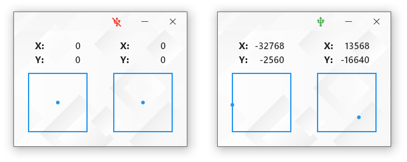
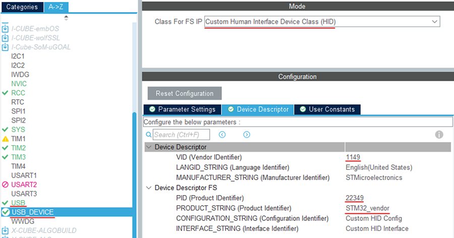
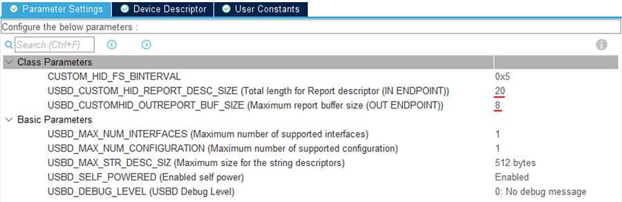

## gamepad_usb_stm32  
#### Приложение для управления STM32 при помощи джойстиков геймпада. Платформа Windows.  

<p align="center">
    
</p>

#### Описание  

Программа каждую секунду опрашивает USB на наличие подключения STM32. При наличии соединения происходит автоматическое подключение и изменение иконки USB на панели AppBar.  

При разрыве соединения программа перейдёт в цикл ожидания подключения.  

При нажатии на кнопку закрытия, сохраняется положение окна на экране монитора и при повторном запуске, приложение развернётся в заданном месте экрана.  

Приложение отправляет с ПК 8 байт данных о положении джойстиков. Каждая ось изменяется в диапазоне от -32768 до 32767, то есть имеет знаковый тип int16_t, разложив это число на два байта получим два знаковый типа int8_t с диапазонами от -128 до 127.  

В результате, для STM32 необходимо создать следующий дексриптор:  

```
char ReportDescriptor[20] = {
    0x06, 0x00, 0xff,              // USAGE_PAGE (Generic Desktop)
    0x09, 0x01,                    // USAGE (Vendor Usage 1)
    0xa1, 0x01,                    // COLLECTION (Application)
    0x09, 0x01,                    //   USAGE (Vendor Usage 1)
    0x15, 0x80,                    //   LOGICAL_MINIMUM (-128)
    0x25, 0x7f,                    //   LOGICAL_MAXIMUM (127)
    0x75, 0x08,                    //   REPORT_SIZE (8)
    0x95, 0x08,                    //   REPORT_COUNT (8)
    0x91, 0x02,                    //   OUTPUT (Data,Var,Abs)
    0xc0                           // END_COLLECTION
};
```
Хостом выступает ПК, который только отправляет данные, ничего не принимая, поэтому используем OUPUT.  

С ПК отправляем 9 байт (прописываем в приложении на Dart), первый байт служебный не используется, остальные 8 (4 направления по 2 байта) значения положения джойстиков. **На STM32 везде указываем 8 байт**.  

<p align="center">
    
</p>

**Значения VID и PID в приложении на Dart и на STM32 должны совпадать**.  

В параметрах указываем интервал ожидания, размер дескриптора и размер буфера для передачи:  

<p align="center">
    
</p>